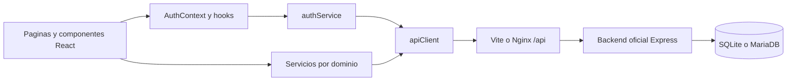
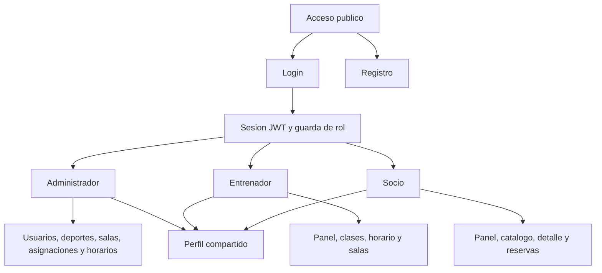

# Arquitectura de Informacion

## Objetivo

La aplicacion separa la navegacion por rol y mantiene una capa comun para autenticacion, perfil, errores y consumo de API. Esta estructura evita mezclar permisos, reduce duplicacion y permite demostrar cada flujo de la pauta por separado.

## Arquitectura tecnica

El frontend solo conoce los contratos HTTP documentados. `apiClient` agrega encabezados, serializa JSON, desenvuelve `{ ok, message, data }` y convierte errores en `ApiError`. Los servicios no contienen logica visual.

## Mapa por rol

## Flujo de sesion

1. Login envia correo y contrasena a `POST /auth/login`.
2. El frontend guarda temporalmente JWT y usuario para restaurar la sesion.
3. Al iniciar, `GET /auth/me` valida el token antes de mostrar rutas privadas.
4. `ProtectedRoute` bloquea visitantes y `RoleRoute` bloquea roles incorrectos.
5. Una respuesta 401 limpia la sesion y devuelve al acceso.

## Flujo CRUD

1. La pagina solicita la lista mediante el servicio del dominio.
2. Crear y editar abren un Modal de React-Bootstrap.
3. La validacion frontend normaliza campos y evita solicitudes invalidas.
4. El servicio ejecuta POST o PUT con JWT.
5. El resultado se comunica con SweetAlert2 y la lista se vuelve a consultar.
6. Eliminar o cambiar estado exige confirmacion antes de enviar la solicitud.

## Flujo de reserva

1. El socio consulta clases y horarios reales.
2. Se comparan los IDs de horarios con reservas activas para evitar duplicados.
3. El Modal envia `{ class_schedule_id, observation? }` a `POST /reservations`.
4. La pagina vuelve a consultar reservas y clases sin recarga.
5. Solo una reserva activa ofrece cancelacion mediante `PATCH /reservations/:id/cancel`.
6. Resumen y calendario semanal se calculan desde la respuesta de reservas.

## Decisiones de interfaz

- Una cabecera y navegacion consistentes para todos los roles.
- Superficies densas y escaneables para trabajo administrativo.
- Tablas responsive con desplazamiento controlado cuando no es posible reordenar columnas.
- Formularios con etiquetas, errores asociados y acciones deshabilitadas durante solicitudes.
- Morado y dorado como identidad comun; rojo, verde y azul como acentos funcionales por rol.
- Los datos faltantes muestran estados explicitos en lugar de valores inventados.
